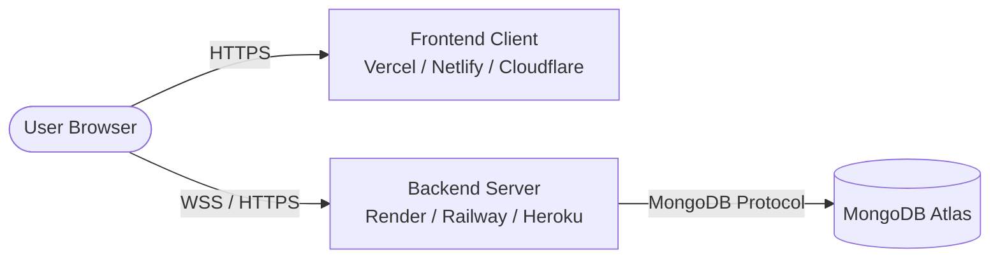

# Separate Hosting Guide 🚀

This document details the configuration, build processes, and hosting environment requirements for deploying the **Auction System Client** (frontend) and **Auction System Server** (backend) to separate hosting providers.

---

## Architecture Overview



Since the client and server run on different domains, cross-origin resource sharing (CORS) is configured dynamically on the server using environment variables to ensure secure communication.

---

## 📦 1. Frontend Client Deployment

The frontend is a React application powered by Vite. It builds to static HTML/CSS/JS and can be hosted on any static hosting provider.

### Host Recommendations
*   **Vercel** (Highly Recommended - configuration pre-loaded)
*   **Netlify**
*   **Cloudflare Pages**
*   **AWS Amplify / S3**

### Build Configuration Settings
When configuring your build settings on your hosting platform, use the following:

| Setting | Value |
| :--- | :--- |
| **Build Command** | `npm run build` |
| **Output Directory** | `client/dist` |
| **Root Directory** | `client` |

### Environment Variables
You must set the following environment variable during the client's build phase:

| Variable | Description | Example (Production) |
| :--- | :--- | :--- |
| `VITE_API_URL` | The secure URL of your deployed backend server. | `https://auction-api.onrender.com` |

> [!WARNING]
> Vite embeds environment variables *at build time*. If you change your backend URL, you must trigger a redeploy of the frontend so that the new URL gets compiled into the client bundle.

### Single Page Application (SPA) Routing
To ensure that page reloads don't result in `404 Not Found` errors, URL rewrites are configured in client/vercel.json.
If you deploy to **Netlify**, add a `_redirects` file inside your `public` folder with:
```text
/*    /index.html   200
```

---

## 🖥️ 2. Backend Server Deployment

The backend is a Node.js server powered by Express and Socket.io. It requires a dynamic, persistent server runtime environment.

### Host Recommendations
*   **Render** (Web Service)
*   **Railway**
*   **Heroku**
*   **DigitalOcean App Platform** or VPS

### Build Configuration Settings
Use these settings when deploying the server:

| Setting | Value |
| :--- | :--- |
| **Build Command** | `npm install` |
| **Start Command** | `node server.js` |
| **Root Directory** | `server` |

### Environment Variables
Set the following environment variables on your server's hosting dashboard:

| Variable | Required | Description | Example / Note |
| :--- | :--- | :--- | :--- |
| `PORT` | No | Port for the server to listen on. Defaults to `5000`. | `5000` (Render handles this automatically) |
| `MONGO_URI` | **Yes** | MongoDB Atlas connection string. | `mongodb+srv://...` |
| `JWT_SECRET` | **Yes** | Secret key for signing client tokens. Use a strong random key. | `generate_with_random_string` |
| `JWT_REFRESH_SECRET` | **Yes** | Secret key for signing refresh tokens. | `generate_with_random_string` |
| `SUPER_ADMIN_PASSWORD` | **Yes** | Password to access the Super Admin control panel. | `secure_admin_password_123` |
| `CLIENT_URL` | **Yes** | Allowed CORS origins. Separate multiple URLs with commas. | `https://auction-system.vercel.app` |

> [!IMPORTANT]
> If `CLIENT_URL` is omitted, the server will default to allowing any origin (`*`). It is highly recommended to explicitly configure this in production to secure your backend.

---

## 🔒 3. CORS and WebSocket Connection Check

Once both parts are deployed, verify the connection:
1. Load your frontend URL in the browser.
2. Open the browser Developer Tools (`F12`) and view the **Console** and **Network** tabs.
3. If you see CORS block errors, verify that:
    *   `CLIENT_URL` on the backend matches your frontend URL *exactly* (without a trailing slash, e.g. `https://my-auction.vercel.app`).
    *   `VITE_API_URL` on the frontend matches the backend URL *exactly*.
